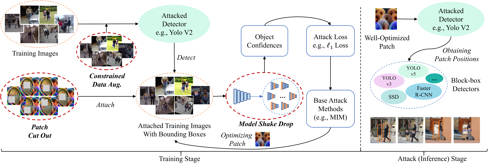
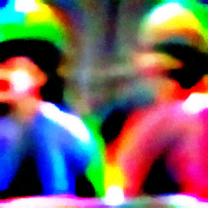

# T-SEA: Transfer-based Self-Ensemble Attack on Object Detection(CVPR 2023)

[**English**](https://github.com/VDIGPKU/T-SEA/blob/main/README.md)
| [**中文**](https://github.com/VDIGPKU/T-SEA/blob/main/README-cn.md)


[**Paper**](https://arxiv.org/abs/2211.09773)
| Hao Huang*, Ziyan Chen*, Huanran Chen*, Yongtao Wang, Kevin Zhang

(*Equal contribution)

An official implementation of T-SEA, and also a framework provided to achieve universal (cross model&instance) patch-based adversarial attack.




If T-SEA is helpful for your work, please help star this repo~ Thanks! :-D

## Update
* 2023.02.02 - v1.2 An anchor-free detector, [CenterNet](https://github.com/xingyizhou/CenterNet), is now supported.
* 2022.11.22 - v1.1 Fix bugs for running train & eval scripts.
* 2022.11.18 - v1.0 This repo is created.


## Install
### Environment

```bash
conda create -n tsea python=3.7
conda activate tsea
pip install -r requirements.txt
```
Please refer to [PyTorch Docs](https://pytorch.org/get-started/previous-versions/) to install `torch` and `torchvision` for better compatibility.

 **Data**

| Data        |                                             Generated Labels                                             |                                              Source                                              |                                            
|-------------|:--------------------------------------------------------------------------------------------------------:|:------------------------------------------------------------------------------------------------:|
| CCTVPerson  |  [GoogleDrive](https://drive.google.com/drive/folders/1R5DDNR0XPvSW-WyuCihDlPHf6C2XXb-o?usp=share_link)  |   [Human Detection](https://www.kaggle.com/datasets/constantinwerner/human-detection-dataset)    |
| COCOperson  |  [GoogleDrive](https://drive.google.com/drive/folders/1zKO6yXllhReiDS04WKkb6JIkxvAW2s_9?usp=share_link)  |                            [HomePage](https://cocodataset.org/#home)                             |
| INRIAPerson |  [GoogleDrive](https://drive.google.com/drive/folders/1zKO6yXllhReiDS04WKkb6JIkxvAW2s_9?usp=share_link)  |               [Paper](https://hal.inria.fr/docs/00/54/85/12/PDF/hog_cvpr2005.pdf)                |

See more details in [Docs](https://github.com/VDIGPKU/T-SEA/blob/main/readme/data.md).


### Run

**Patch Zoo** - See more results in [GoogleDrive](https://drive.google.com/drive/folders/1bGDf5fHVxajexKZUk22OMc5wag_adH-e?usp=share_link) | [BaiduCloud](https://pan.baidu.com/s/1U3L0cOOeUr0RfFf4rSfYmQ?pwd=f946).

| Faster RCNN               | SSD                               | Yolo V5                   | Yolo V3  |CenterNet |
|---------------------------|----------------------------------|--------------------------|:------------:| ----|
|  |  |  |  | |

#### Evaluation

The evaluation metrics of the **Mean Average Precision([mAP](https://github.com/Cartucho/mAP))** is provided.

```bash
# You can run the demo script directly:
bash ./scripts/eval.sh 0 # gpu id
```

```bash
# To run the full command in the root proj dir:
python evaluate.py \
-p ./results/v5-demo.png \
-cfg ./configs/eval/coco80.yaml \
-lp ./data/INRIAPerson/Test/labels \
-dr ./data/INRIAPerson/Test/pos \
-s ./data/test \
-e 0 # attack class id

# for torch-models(coco91): replace -cfg with ./configs/eval/coco91.yaml

# For detailed supports of the arguments:
python evaluate.py -h
```

#### Training
```bash
# You can run the demo script directly:
bash ./scripts/train.sh 0 -np
# args: 0 gpu-id, -np new tensorboard process
```

```bash
# Or run the full command:
python train_optim.py -np \
-cfg=demo.yaml \
-s=./results/demo \
-n=v5-combine-demo # patch name & tensorboard name

# For detailed supports of the arguments:
python train_optim.py -h
```
The default save path of tensorboard logs is **runs/**.

Modify the config .yaml files for custom settings, see details in [**README**](https://github.com/VDIGPKU/T-SEA/blob/main/configs/README.yaml).


## Framework Overview

We provide a main pipeline to craft a universal adversarial patch to achieve cross-model & cross-instance attack on detectors, 
and support evaluations on given data & models.
See more details in [**README**](https://github.com/VDIGPKU/T-SEA/blob/main/readme/overview.md).

## Acknowledgements

* AdvPatch - [**Paper**](http://openaccess.thecvf.com/content_CVPRW_2019/papers/CV-COPS/Thys_Fooling_Automated_Surveillance_Cameras_Adversarial_Patches_to_Attack_Person_Detection_CVPRW_2019_paper.pdf) 
| [Source Code](https://gitlab.com/EAVISE/adversarial-yolo)

## Citation
```
@inproceedings{huang2023t,
  title={T-sea: Transfer-based self-ensemble attack on object detection},
  author={Huang, Hao and Chen, Ziyan and Chen, Huanran and Wang, Yongtao and Zhang, Kevin},
  booktitle={Proceedings of the IEEE/CVF Conference on Computer Vision and Pattern Recognition},
  pages={20514--20523},
  year={2023}
}
```

## Contact Us
If you have any problem about this work, please feel free to reach us out at `huanghao@stu.pku.edu.cn`.

## License

The project is only free for academic research purposes, but needs authorization forcommerce. For commerce permission, please contact wyt@pku.edu.cn.
