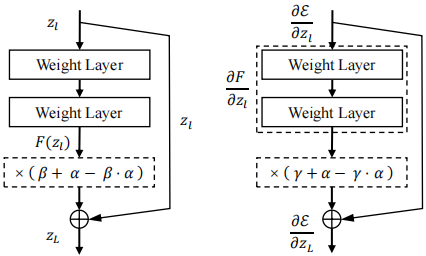

# Detlib

Detlib should support detection models and agent methods for 
unified calls like detections format parser.

We currently support detection models as:
* **HHDet**(PyTorch): Yolo V2, V3, V3-tiny, V4, V4tiny, V5

| Model                                        |                                      PyTorch implementation                                       |                                  Source                                   |                                            
|----------------------------------------------|:-------------------------------------------------------------------------------------------------:|:-------------------------------------------------------------------------:|
| [YoloV2](https://arxiv.org/abs/1506.02640)   |                 [pytorch-yolo2](https://github.com/ayooshkathuria/pytorch-yolo2)                  |                [Page](https://pjreddie.com/darknet/yolo/)                 |
| [YoloV3](https://arxiv.org/abs/1804.02767v1) |                [PyTorch-YOLOv3](https://github.com/eriklindernoren/PyTorch-YOLOv3)                |                [Page](https://pjreddie.com/darknet/yolo/)                 |
| [YoloV4](https://arxiv.org/abs/2004.10934)   |                  [pytorch-YOLOv4](https://github.com/Tianxiaomo/pytorch-YOLOv4)                   | [Source Code](https://github.com/AlexeyAB/darknet) |
| YooV5                                        | [yolov5](https://github.com/ultralytics/yolov5) |                   [Docs](https://docs.ultralytics.com/)                   |

* **TorchDet**(PyTorch): Faster RCNN(renet50), ssd(vgg16) & ssdlite(mobilenet v3 large)

|                      Model                       |                                        
|:------------------------------------------------:|
|  [FasterRCNN](https://arxiv.org/abs/1506.01497)  |
|     [SSD](https://arxiv.org/abs/1512.02325)      |
|   [SSDLite](https://arxiv.org/abs/1905.02244)    |

PyTorch Detection Lib - [**Docs**](https://pytorch.org/vision/0.10/models.html) | [**Paper**](https://arxiv.org/abs/1912.01703)


* **AfreeDet**: Anchor-free detectors.

| Model                                          |                      Source                      |                                 
|------------------------------------------------|:------------------------------------------------:|
| [CenterNet](http://arxiv.org/abs/1904.07850)   | [Code](https://github.com/xingyizhou/CenterNet)  |


Model perturbation(e.g. Shakedrop) function is achieved and implemented inside detector module.

You can support your custom models by inheriting the base class and rewriting required methods.

---
### Detector Base
Main methods explained:
```python
from abc import ABC, abstractmethod

class DetectorBase(ABC):
    def __init__(self, name: str, cfg, input_tensor_size: int, device: torch.device):
        pass
    
    @abstractmethod
    def load(self, model_weights: str, **args):
        pass
    
    @abstractmethod
    def __call__(self, batch_tensor: torch.tensor, **kwargs):
        pass
    
    def requires_grad_(self, state: bool):
        # Set model.requires_grad_(False) can greatly speed up your inference.
        # Default action provided. You may need to rewrite this method if the action is different.
        assert self.detector, 'ERROR! Detector model not loaded yet!'
        assert state is not None, 'ERROR! Input param (state) is None!'
        self.detector.requires_grad_(state)
        
    def eval(self):
        # This is to fix the model.
        # Default action provided. You may need to rewrite this method if the action is different.
        assert self.detector
        self.detector.eval()
        self.requires_grad_(False)
```

---

### Pretrained models

To setup pretrained detector models.

```bash
# Run this command in the project dir
bash ./detlib/weights/download.sh
bash ./detlib/weights/setup.sh
```
Currenly only the provided models supported.

---
### Custom Detetion lib
You can support your custom detectors by providing a simple detector API.
Take the custom Yolo v3 as an example: 
```python
from base import DetectorBase

# Inherient the base class.
class HHYolov3(DetectorBase):
    def __init__(self, name, cfg, input_tensor_size=412, device):
        super().__init__(name, cfg, input_tensor_size, device)
        
    def load(self, model_weights, detector_config_file=None):
        # To load pretrained model and fix it.
        self.detector = load_weights()
        self.eval()
        pass

    def __call__(self, batch_tensor, **kwargs):
        # Obtain & format the detection results of the given image batch tensor.
        detections = self.detector()
        # Process labels as tensor([[cls_id, xmin, ymin, xmax, ymax], [], []])...
        pass

    def requires_grad_(self, state: bool):
        # Rewrite the mothed for a differnt requires_grad_ action.
        self.detector.module_list.requires_grad_(state)
```

#### ShakeDrop



The implementation of the model ShakeDrop in T-SEA is a modified version to fit our attacks. 
We perturb the detection model in both forward and backward propagation of every inference process. 

Note that we only perturb models in inference time since the attack will not involve the model training process, which is different from the original [**ShakeDrop**](https://openreview.net/forum?id=S1NHaMW0b). 
In this way, we keep the factor of multiplicative disturbance, `alpha` and `beta`,  as 1 by sampling from a continuous uniform distribution `U(1-e, 1+e)`.

```python
class ShakeDrop(torch.autograd.Function):
    @staticmethod
    def forward(ctx, x, p_drop=0.5, alpha_range=[0, 2]):
        gate = torch.cuda.FloatTensor([0]).bernoulli_(1 - p_drop)
        ctx.save_for_backward(gate)
        if gate.item() == 0:
            alpha = torch.cuda.FloatTensor(x.size(0)).uniform_(*alpha_range)
            alpha = alpha.view(alpha.size(0), 1, 1, 1).expand_as(x)
            return alpha * x
        else:
            return x

    @staticmethod
    def backward(ctx, grad_output, beta_range=[0, 2]):
        gate = ctx.saved_tensors[0]
        if gate.item() == 0:
            beta = torch.cuda.FloatTensor(grad_output.size(0)).uniform_(*beta_range)
            beta = beta.view(beta.size(0), 1, 1, 1).expand_as(grad_output)
            beta = Variable(beta)
            return beta * grad_output, None, None, None
        else:
            return grad_output, None, None, None
```

If you wanna use ShakeDrop perturbation to improve attack, 
you may apply the ShakeDrop function to the output of the residual block.

Take the `BasicBlock` of the centernet as an example.
```python
class BasicBlock_ShakeDrop(BasicBlock):
    def __init__(self, inplanes, planes, stride=1):
        super(BasicBlock_ShakeDrop, self).__init__(inplanes, planes, stride)

    def forward(self, x):
        residual = x
    
        out = self.conv1(x)
        ...
        out = self.bn2(out)
    
        # print(out.shape)
        out = ShakeDrop.apply(out) + residual
        return self.relu(out)
```

More modification details can be found in [resnet_dcn.py](https://github.com/VDIGPKU/T-SEA/blob/main/detlib/AfreeDet/CenterNet/CenterNet/src/lib/models/networks/resnet_dcn.py).